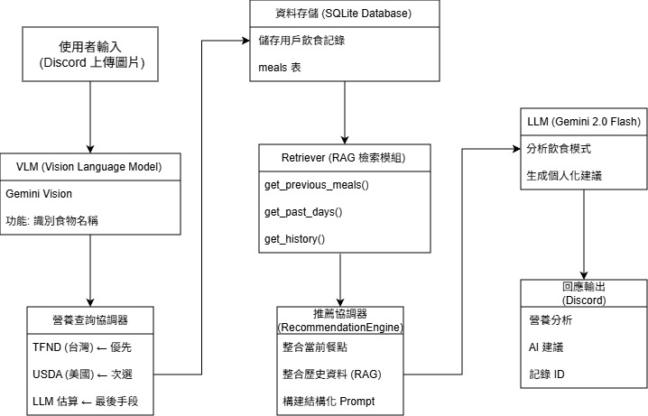

# Food Nutritionist 2.0

An AI-powered food recognition and nutrition recommendation system developed as a three-person undergraduate capstone project at Chung Yuan Christian University.

The system allows users to upload meal images through Discord, identifies food items using vision-language models, retrieves nutritional information from structured databases, records dietary history, and generates personalized dietary recommendations.

## Key Features

- **Food Image Recognition:** Uses Google Gemini Vision as the primary recognition tool, with Azure Computer Vision as a fallback.
- **Nutrition Information Retrieval:** Searches the Taiwan Food Nutrient Database (TFND) first and uses the USDA FoodData Central API as a fallback source.
- **Dietary History Tracking:** Stores meal records, meal types, and nutritional information in a local SQLite database.
- **Personalized Recommendations:** Retrieves users' previous meals and recent dietary patterns, then incorporates the retrieved information into prompts for recommendation generation.
- **Discord Bot Interface:** Allows users to upload meal images and receive food-recognition results, nutritional analysis, and dietary suggestions directly through Discord.
- **Testing and Error Handling:** Includes unit, integration, and end-to-end tests for the major system components.

## System Workflow

1. The user uploads a meal image through Discord.
2. Gemini Vision identifies the food items in the image, with Azure Computer Vision available as a fallback.
3. The system retrieves nutritional information from TFND using exact or fuzzy matching.
4. If no suitable TFND result is found, the system queries the USDA FoodData Central API.
5. The meal and its nutritional information are stored in SQLite.
6. The system retrieves the user's recent dietary history.
7. Gemini generates personalized recommendations using the current meal and retrieved dietary records.

## System Architecture

## Technologies

- **Programming Language:** Python
- **Interface:** Discord.py
- **Vision-Language Model:** Google Gemini
- **Computer Vision:** Azure Computer Vision, OpenCV
- **Nutrition Data:** Taiwan Food Nutrient Database (TFND), USDA FoodData Central API
- **Database:** SQLite
- **Testing:** Pytest

## Awards

- **First Place, Multimedia Category**, Department Capstone Project Exhibition, Department of Computer Science, Chung Yuan Christian University, 2025
- **Honorable Mention**, College of Electrical Engineering and Computer Science Capstone Project and Creative Concept Competition, Chung Yuan Christian University, 2025

## Documentation

For detailed installation instructions, API configuration, module descriptions, and testing information, see the [full documentation](diet_tracker_bot/docs/README.md).

Additional project materials:

- [Project Report (Chinese)](diet_tracker_bot/docs/report/食物營養師專題報告.pdf)
- [Presentation Slides (Chinese)](diet_tracker_bot/docs/report/食物圖像辨識及%20RAG結合VLM之%20食物營養推薦模型.pptx)

## Disclaimer

This project was developed for academic and demonstration purposes. The nutritional information and AI-generated recommendations should not be considered professional medical or dietary advice.
